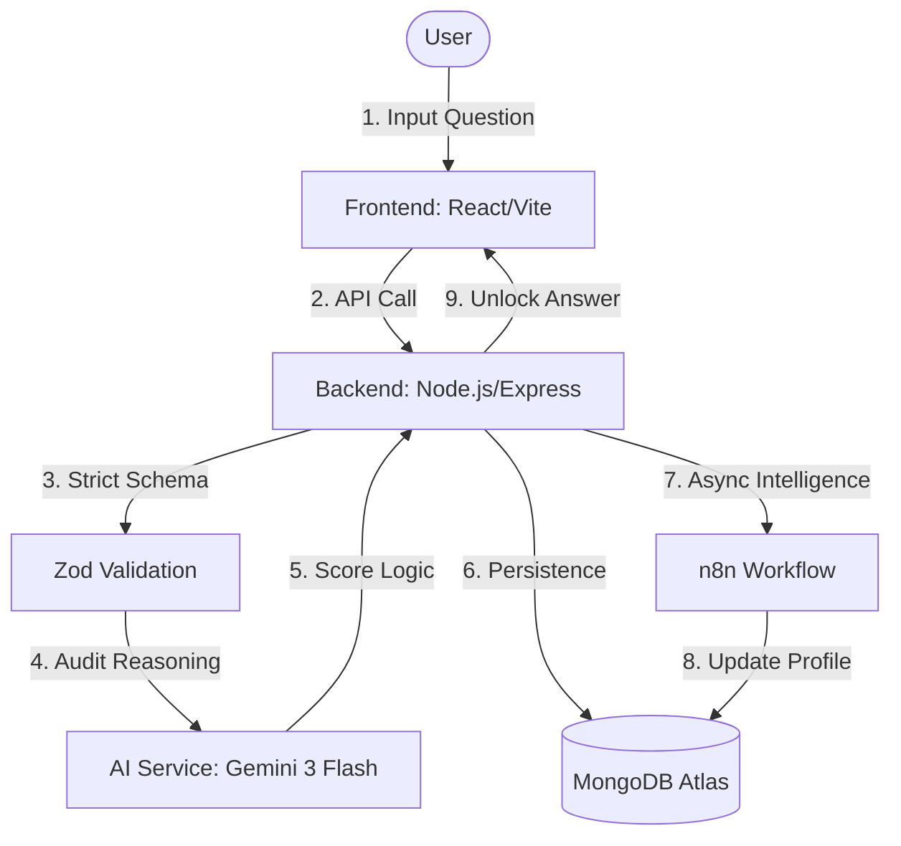

# 🛡️ ThinkLock | Reclaiming Human Intelligence

## 🚀 Project Overview
**ThinkLock**
*Enforced Reasoning in the Age of Instant Automation.*

A cognitive-first intelligence platform that **blocks instant AI answers**, forcing users to demonstrate active reasoning before unlocking insights.

---

## ⚠️ Problem Statement
*   **Cognitive Atrophy:** The "Copy-Paste" loop is literally making us less capable. By skipping the hard work of thinking, we’re losing the fundamental skills that make human intelligence valuable.

*   **The Illusion of Competence:** Getting the right answer isn't the same as understanding it. We're creating a world of "answer-getters" who can't explain the logic behind their own work.

*   **Passive Intelligence:** We’ve become secondary characters in our own intellectual lives. We are letting algorithms lead the way while our own critical thinking stays in the passenger seat.

*   **The Logic Void:** There is no growth in instant results. Growth happens in the struggle of reasoning, and we’ve successfully automated that struggle away.

*   **The Dependency Debt:** Every AI shortcut is a debt we owe to our future selves. We are trading long-term cognitive power for short-term speed, leading to a massive "logic gap" when the tools fail.

---
## 💡Solution
ThinkLock isn't just another AI tool—it's a **cognitive gatekeeper**. In a world that values speed over substance, ThinkLock enforces a "thinking tax" on every query. It acts as a bridge between human curiosity and artificial intelligence, ensuring that while the AI provides the answers, your brain does the heavy lifting.

*   **The Cognitive Firewall:** ThinkLock is the first middleware designed to protect your brain. It stops AI from giving you the answer until you prove you’ve actually engaged with the problem.

*   **From "Search" to "Solve":** We replace the lazy "Ask and Receive" loop with a "Prove and Unlock" system. You don't get the insight because you asked; you get it because you earned it through active reasoning.

*   **Thought-Audit Engine:** Our system doesn't just look for answers—it audits your logic. It evaluates *how* you think, ensuring your reasoning is sound before granting access to the AI's power.

*   **Friction on Purpose:** Most tools try to be "seamless." ThinkLock adds intentional friction to re-engage your brain, forcing you out of autopilot and back into deep, critical thinking.

*   **The Reasoning Loop:** A simple, high-impact flow: **Question** → **Challenge** → **Proof** → **Unlock**. Every interaction becomes a mental workout, turning AI into a partner for growth rather than a crutch for laziness.

---

## 🔑Key Features
ThinkLock is packed with tools designed to gamify and protect your intellectual growth. Every module is built to ensure you’re not just getting answers, but building a better brain.

*   🧠 **Thinking Graph:** A dynamic, visual map of your logic. Watch as your premises, inferences, and conclusions form a living network of your own reasoning.

*   📊 **Cognitive Scoring:** Get real-time feedback on your **Depth of Thought**. Our proprietary algorithm scores your logic quality, consistency, and first-principles application.

*   🛡️ **Anti-Gaming Shield:** Our AI-driven security layer detects "shortcut behaviors" and copy-pasted input, ensuring you’re actually thinking and not just tricking the system.

*   ⚙️ **Adaptive Difficulty:** ThinkLock grows with you. The system detects "lazy patterns" and increases the reasoning friction to force you out of your cognitive comfort zone.

*   ⏪ **Reasoning Replay:** Review your thought process like a pro. Revisit past sessions to identify logical fallacies and sharpen your future problem-solving skills.

*   📈 **AI Dependency Tracker:** Visualize your evolution. Track the ratio of AI assistance vs. human reasoning to ensure your "mental muscle" is growing, not atrophying.

---

## 🏗️System Architecture
ThinkLock follows a **Micro-Orchestration** pattern designed for high-integrity cognitive validation and state management.



### Component Breakdown
*   **Frontend (React/Vite):** A premium, responsive interface that visualizes the **Thinking Graph** and provides real-time logical feedback.

*   **Orchestration Layer (Node.js):** The central engine that manages session states, enforces security guards, and coordinates between the user and AI.

*   **Intelligence Layer (Gemini 3):** Our "Strict Tutor" that audits human reasoning, detects fallacies, and generates adaptive challenges.

*   **Validation Layer (Zod):** Guarantees runtime data integrity, ensuring that every reasoning node conforms to strict logical structures.

*   **Persistence (MongoDB):** A document-based store for reasoning journeys, cognitive profiles, and high-fidelity event logs.

*   **Async Analysis (n8n):** Offloads heavy behavioral trend analysis and cognitive scoring to an asynchronous workflow loop to maintain zero-latency UX.

---

### Step-by-Step Data Flow Walkthrough
1.  **Input Question:** The user starts their journey by submitting a prompt. Instead of a direct answer, the system analyzes the complexity of the query to prepare a tailored cognitive challenge.

2.  **API Call:** The React frontend communicates with the Express backend via a secure REST API. This request carries the user's intent and current session context.

3.  **Strict Schema:** Before any processing, **Zod** performs a deep schema audit. This ensures that the incoming data is sanitized and conforms to our internal logic models, preventing injection attacks.

4.  **Audit Reasoning:** The backend hands the request to the **Gemini 3** engine. The AI doesn't solve the problem; instead, it identifies the "Reasoning Gap"—the logical steps the user *must* take to earn the answer.

5.  **Score Logic:** As the user submits their reasoning nodes, the AI evaluates them for logical consistency, depth, and fallacies. It returns a "Depth Score" that determines if the user has thought deeply enough.

6.  **Persistence:** Every interaction, including every node in the thinking graph, is persisted in **MongoDB Atlas**. This ensures session durability and provides the raw data for cognitive analytics.

7.  **Async Intelligence:** To keep the UI fast, heavy behavioral analysis is offloaded to **n8n**. This workflow analyzes "Time-to-Reason" and logical complexity without blocking the main event loop.

8.  **Update Profile:** n8n uses the analyzed data to update the user's long-term **Cognitive Profile**, tracking their evolution from an "Observer" to a "Logic Mastermind."

9.  **Unlock Answer:** Only after the AI confirms that the user's reasoning is sound and the Depth Score meets the required threshold does the backend finally release the "Locked" answer.

---

## 🛠️ Tech Stack
| Layer | Technologies | Purpose |
| :--- | :--- | :--- |
| **Frontend** | React 18, TypeScript, Vite, Tailwind CSS, Shadcn UI, Framer Motion | Premium UI/UX, Type-safe components, Smooth animations. |
| **Backend** | Node.js, Express, Winston | Scalable API orchestration, structured logging. |
| **Database** | MongoDB Atlas, Mongoose | High-fidelity persistence for reasoning journeys. |
| **AI Layer** | Google Gemini 3 Flash & Pro | Reasoning audits, cognitive scoring, challenge generation. |
| **Automation** | n8n Cloud | Async behavioral analysis and background intelligence. |
| **DevOps** | Vercel, Render | Automated deployment and high-availability hosting. |

---

## 📂 Project Structure
```text
ThinkLock/
├── backend/                    # Node.js + Express.js Server
│   ├── src/
│   │   ├── controllers/        # Request Handlers
│   │   │   ├── chat.controller.js
│   │   │   └── session.controller.js
│   │   ├── middlewares/        # Security & Validation
│   │   │   ├── auth.middleware.js
│   │   │   └── error.middleware.js
│   │   ├── models/             # Mongoose Data Models
│   │   │   ├── session.model.js
│   │   │   └── message.model.js
│   │   ├── routes/             # API Endpoints
│   │   │   ├── chat.routes.js
│   │   │   └── session.routes.js
│   │   ├── services/           # Core Business & AI Logic
│   │   │   ├── message.service.js
│   │   │   └── session.service.js
│   │   └── app.js              # Express App Config
│   ├── server.js               # Entry Point
│   └── package.json
├── src/                        # React + Vite Frontend
│   ├── components/             # UI Components
│   │   ├── dashboard/          # Dashboard specific UI
│   │   ├── ui/                 # Shadcn UI Components
│   │   └── DashboardLayout.tsx
│   ├── pages/                  # View Components
│   │   ├── dashboard/          # Reasoning Lab, Control Room
│   │   ├── About.tsx
│   │   ├── Login.tsx
│   │   └── Signup.tsx
│   ├── store/                  # State Management
│   │   └── useChatStore.ts     # Chat & Reasoning State
│   ├── App.tsx                 # Routing & Core Layout
│   ├── index.css               # Design System & Tailwind
│   └── main.tsx                # App Bootstrap
├── tailwind.config.ts          # Styling Token Config
└── vite.config.ts              # Build Orchestration
```

---

## ⚙️ Core Backend Design
ThinkLock's backend is built for **resilience and logical integrity**. It follows a strict "Decoupled Orchestration" model to ensure that AI validation and user state remain synchronized at all times.

*   **Modular Service Architecture:**
    *   Business logic is **100% decoupled** from the Express routing layer.
    *   Services handle complex AI audits, session state transitions, and cognitive scoring.
    *   Enables independent testing of core logic without mocking HTTP requests.

*   **Controller Isolation Pattern:**
    *   Controllers focus purely on **request parsing and response formatting**.
    *   Delegates all heavy lifting to specialized services, keeping the API layer lean.
    *   Maintains a clean separation of concerns and improves code discoverability.

*   **Multi-Stage Middleware Pipeline:**
    *   **Auth Guards:** Strict JWT-based session validation for all protected routes.
    *   **Security Headers:** Helmet.js and CORS pre-configured for enterprise-grade safety.
    *   **Rate Limiting:** Protects sensitive AI endpoints from brute-force "gaming" or spam attempts.

*   **Strict Runtime Validation (Zod):**
    *   Every incoming API request is validated against **Zod schemas** at the edge.
    *   Provides "Fail-Fast" protection, ensuring only sanitized data reaches the logic layer.
    *   Eliminates "undefined" errors by enforcing strict type contracts at runtime.

*   **Fault-Tolerant Error Handling:**
    *   Centralized **Global Error Middleware** catches all operational and programmer errors.
    *   Uses specialized `AppError` classes to categorize errors (Validation, Auth, Logic, etc.).
    *   Structured logging via **Winston** for high observability and debugging in production.

*   **Reliable Event Sync:**
    *   Uses an **Event Outbox** pattern to ensure state changes are reliably synced with background services.
    *   Ensures the **n8n Intelligence Loop** always receives the necessary signals for behavioral analysis.

---

## 🤖 AI Pipeline Design
The ThinkLock AI pipeline is the **core cognitive engine** of the platform. It uses a multi-layered validation strategy to ensure that AI-generated challenges and human-logic audits are both rigorous and accurate.

*   **System-Enforced Personas:**
    *   Uses advanced **System Instructions** to lock models into a "Strict Socratic Tutor" persona.
    *   Prevents models from giving direct answers, forcing them to focus entirely on **logical deconstruction** and challenge generation.

*   **Deterministic JSON Mode:**
    *   All AI interactions are forced into **Strict JSON Mode** for reliable backend parsing.
    *   Schemas are pre-defined to capture **Depth Scores**, **Logical Fallacies**, and **Reasoning Gaps** in a structured format.

*   **Multi-Model Orchestration:**
    *   **Gemini 3 Flash:** Handles fast, initial audits and challenge generation to maintain low latency.
    *   **Gemini 3 Pro:** Reserved for deep reasoning validation and complex edge-case logical audits where high precision is required.

*   **Intelligent Failover & Resilience:**
    *   **Quality-Based Failover:** Automatically promotes a task from Flash to Pro if the initial reasoning audit is ambiguous or low-quality.
    *   **Retry with Backoff:** Implements exponential backoff to handle **429 (Rate Limit)** errors gracefully during peak usage windows.

*   **Score Normalization & Validation:**
    *   Backend audits all AI-generated scores to ensure they fall within **expected logical bounds**.
    *   Prevents "Score Inflation" or "Hallucinated Logic" by cross-referencing AI outputs with the user's historical cognitive profile.

*   **Reasoning Gap Identification:**
    *   The pipeline doesn't just check for "Correctness"; it identifies the specific **logical steps** a user missed.
    *   Enables the **Adaptive Difficulty** system to pinpoint exactly where a user's reasoning needs strengthening.

---

## 💾 Data Models
ThinkLock uses a **highly relational document model** within MongoDB to track the evolution of human logic. The schema is designed for both high-fidelity persistence and fast analytical traversal.

*   **User & Cognitive Profile:**
    *   Stores core identity, authentication data, and the **Cognitive Evolution** state.
    *   Tracks tier-based rankings (e.g., Observer, Thinker, Mastermind) and historical logic performance.

*   **Reasoning Session:**
    *   The primary container for a single cognitive journey from question to unlock.
    *   Maintains the "Lock" status, active graph nodes, and the **Adaptive Difficulty** settings.

*   **Message & Logic Audit:**
    *   Stores user input alongside deep metadata from the **AI Audit pipeline**.
    *   Captures detected logical fallacies, reasoning depth scores, and specific logic flags.

*   **Cognitive Metrics (Timeseries):**
    *   Aggregated snapshots of a user's reasoning consistency, depth, and speed over time.
    *   Powers the **Dependency Tracker** and real-time dashboard trend visualizations.

*   **Reliability Event (Outbox):**
    *   Durable records of critical system events (e.g., `SESSION_COMPLETED`, `LOGIC_FAIL`).
    *   Ensures 100% reliability for asynchronous sync with background intelligence services (n8n).

*   **Thinking Graph Node:**
    *   Represents atomic units of reasoning: **Premise**, **Inference**, **Conclusion**, and **Fallacy**.
    *   Stored with adjacency metadata to allow for dynamic graph rendering in the frontend.

---

## 🧠 Thinking Graph Design
*   **Dynamic Node Types:** Categorizes reasoning into `Premise`, `Inference`, `Conclusion`, and `Fallacy`.
*   **Semantic Relationships:** Uses `Supports`, `Contradicts`, and `Derives From` to build a logical web.
*   **Real-time Construction:** Nodes are added dynamically by the user to visualize their thought flow.
*   **Persistence Strategy:** Optimized adjacency list storage in **MongoDB** for rapid graph traversal.

---

## 🛡️ Anti-Gaming System
*   **Multi-Signal Detection:** Analyzes **Response Latency**, **Semantic Overlap**, and **Prompt Injection** patterns.
*   **Escalation Protocol:** Follows a strict `Warning` → `Locked Session` → `Cognitive Reset` workflow.
*   **Smart Filtering:** Distinguishes between concise logic and "word salad" filler intended to trick the auditor.

---

## 📈 Dependency Tracking System
*   **Core Metrics:** Tracks **AI-to-Human Ratio**, **Hint Reliance**, and **Average Time-to-Reason**.
*   **Weighted Scoring:** Favors independent logic over "assisted" conclusions to ensure true growth.
*   **Trend Reporting:** Weekly analytics on whether your **reasoning muscle** is strengthening or atrophying.

---

## 📊 Cognitive Scoring System
*   **Logic Parameters:** Evaluates **Logical Consistency**, **Depth of Inquiry**, and **First Principles Application**.
*   **Weighted Metrics:** **Depth** is weighted 2x higher than speed to discourage superficial rapid-fire answers.
*   **Tier Progression:** Users advance through `Observer`, `Thinker`, `Architect`, and `Mastermind` based on performance.

---

## 🔗 n8n Integration
*   **Event Dispatching:** Backend pushes high-fidelity behavioral signals to a durable **Event Outbox**.
*   **Secure Webhooks:** n8n consumes these events via encrypted webhooks for external intelligence processing.
*   **Heavy Lifting:** Offloads complex **Trend Analysis** and long-term behavioral auditing from the main API.
*   **State Feedback:** n8n programmatically updates **User Classifications** in MongoDB via secure API callbacks.

---

## 📡 API Design
*   **RESTful Architecture:** Clear, resource-based routing for sessions, messages, and profiles.
*   **Secure Auth:** Stateless **JWT-based** authentication with secure HTTP-only cookies.
*   **Core Flow:** High-performance endpoints for `POST /api/chat/send` and `GET /api/chat/profile`.
*   **Fault Tolerance:** Native support for `Idempotency-Key` headers to handle network retries safely.

---

## ✅ Validation & Error Handling
*   **Edge Validation:** Uses **Zod** for strict, fail-fast schema validation at the entry point.
*   **AI JSON Integrity:** Recursive validation of AI-generated responses to ensure logic-score consistency.
*   **Error Taxonomy:** Clearly distinguishes between `OperationalError` (User) and `ProgrammingError` (System).

---

## 🛑 Limitations
*   **Current Constraints:** AI latency and free-tier **cold starts**.
*   **Known Issues:** Minor rendering delays on complex graphs.
*   **Trade-offs:** Speed is sacrificed for **reasoning depth**.

---

## 🔮 Future Improvements
*   **Collaborative Logic:** **Team Mode** for group-based reasoning and collective problem-solving.
*   **Offline Mode:** Local-first reasoning storage for intermittent connectivity.
*   **Domain Expertise:** Fine-tuned AI models for specific technical domains (Engineering, Law, Medicine).

---

## 📧 Maintainers
*   **Author Info:** **Vinni Kapoor**

*   **Contact Details:** [GitHub](https://github.com/Vinni5566)

---
